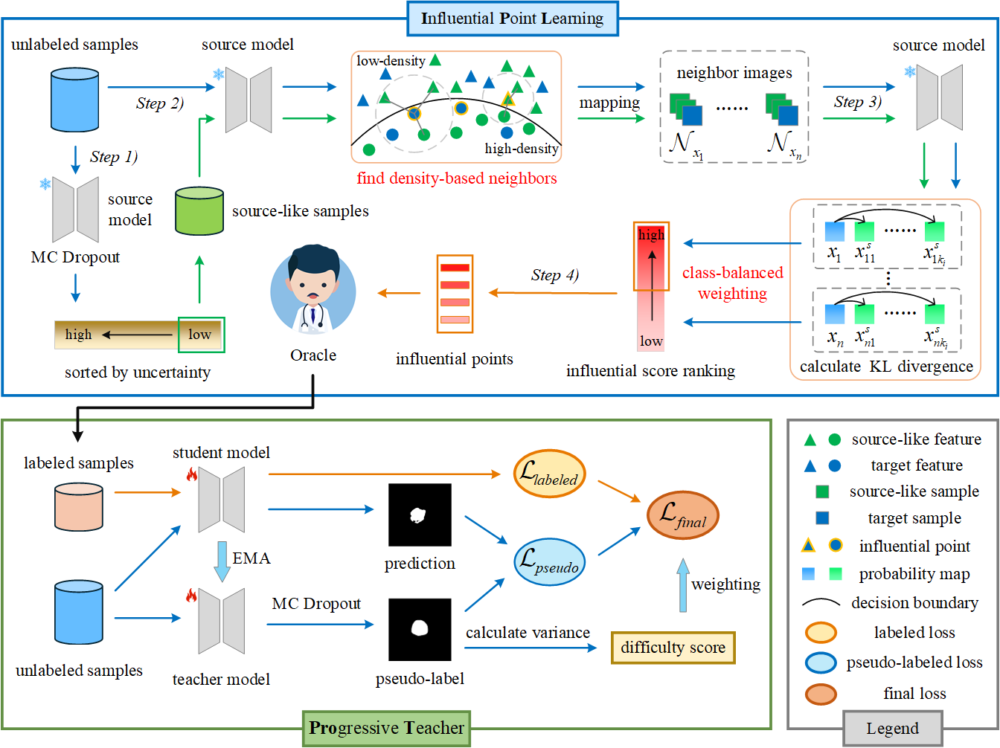
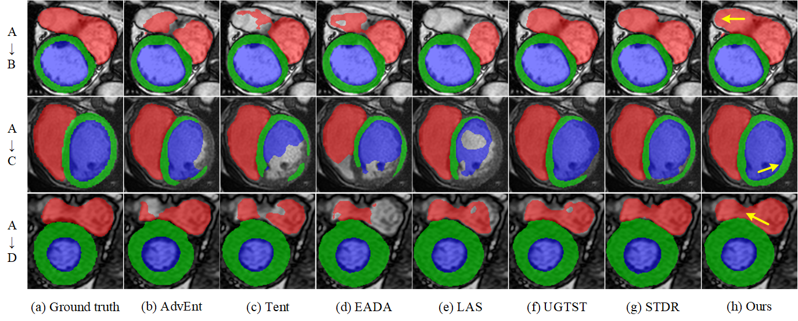
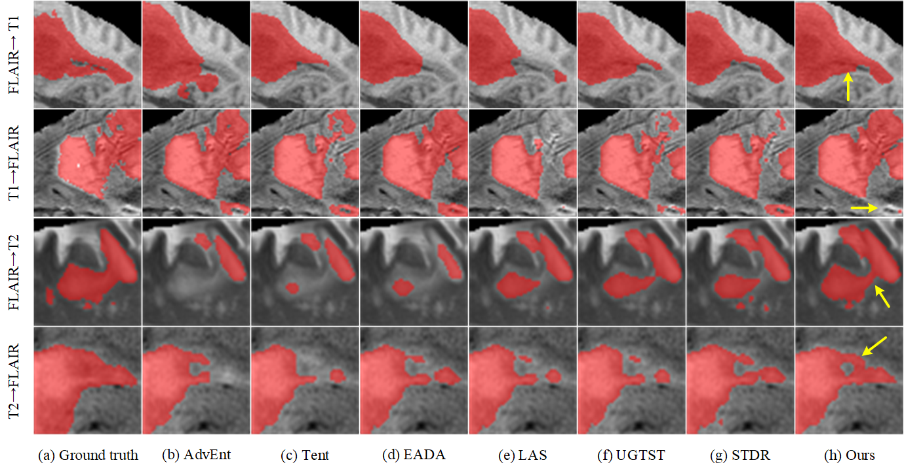

# Source-Free Active Domain Adaptation via Influential-Points-Guided Progressive Teacher for Medical Image Segmentation

## Introduction 📜
This project proposes a novel Source-Free Active Domain Adaptation (SFADA) method for medical image segmentation.\
We first introduce an influential point learning (IPL) slice-wise framework to actively select influential points for oracle annotation. Within this framework, we develop an adaptive KNN algorithm to construct neighborhoods of source-like samples, enabling the transfer of source-specific knowledge. A class-balanced KL divergence is introduced to select diverse samples near the boundary for labeling. The progressive teacher (ProT) model is designed to generate and utilize reliable pseudo-labels independently. The fully supervised learning is performed on labeled samples. For unlabeled samples, curriculum learning-based self-training is adopted to further reduce the negative impact of noisy pseudo-labels.\
The experimental results on three multi-domain datasets demonstrate that our method outperformes state-of-the-art methods, even with only 2.5% of the labeling budget.

The overall framework of our method:

## Dataset 📂

Datasets can be downloaded from the following sources::

- Multi-centre, Multi-vendor and Multi-disease Cardiac Segmentation Dataset: click [here](https://www.ub.edu/mnms/).
- Multi-site Prostate Segmentation Dataset: click [here](https://liuquande.github.io/SAML/).
- Multi-modal Brain Tumor Segmentation: click [here](https://www.med.upenn.edu/cbica/brats2020/data.html).

For example, for the Multi-site Prostate Segmentation Dataset, the dataset directory is organized as follows:
```
your_dataset_path/Prostate_RUNMC_BMC/
       images/
              Case01.nii.gz
              ...
       labels/
              Case01.nii.gz
              ...
```

## How to Run the Code 🚀
We provide the following step-by-step instructions to facilitate the reproduction of our method.
### Step 0: Preparation

#### 1. Environment Installation 🖥️
Requirements: Ubuntu 20.04, CUDA 12.4.

	1. Create a virtual environment: conda create -n SFADA python=3.7 -y

    2. Activate the environment and navigate to the project directory: conda activate SFADA, cd /your_root_path/IPGPT-SFADA
 
	3. Install PyTorch: pip install torch==1.11.0+cu113 torchvision==0.12.0+cu113 -f https://download.pytorch.org/whl/torch_stable.html

	4. Install other dependencies: pip install -r requirements.txt

#### 2. Preprocess Data 🔄

The data preprocessing procedure includes dataset partitioning and format conversion. All data were split into training, validation, and testing sets in a 7:1:2 ratio. To accelerate the training process, the original nii.gz files were converted to the h5 format. These steps have been integrated into `data_processing.py`.

To run this code, you need to set `root_path` to the path of the datasets and set `domain` to the domain name.

`python dataloaders/data_processing.py --root_path /home/data/CY/Datasets --domain Prostate_RUNMC_BMC`

### Step 1: Training source model 🕸️
To train the source model, specify `root_path` as the path to the source domain dataset, set `source` to the corresponding domain name, and use `num_classes` to define the number of segmentation classes.
For example:

`python train_source.py --root_path /home/data/CY/Datasets/Prostate_RUNMC_BMC --source Prostate_RUNMC_BMC --num_classes 2`

### Step 2: Select source-like samples and influential points 🎯

#### 1. select source-like samples
You can select source-like samples from the target domain by running:

`python selection/select_source_like_samples.py --target_path /home/data/CY/Datasets/Prostate_HCRUDB/training_set --checkpoint /home/data/CY/code/IPGPT-SFADA/Model/Prostate_RUNMC_BMC_unet/unet_best_model.pth --p 50 --uncertainty variance --save_path /home/data/CY/Datasets/Prostate_HCRUDB/source_like --num_classes 2`

Arguments:

--target_path: Path to the training set of the target domain.\
--checkpoint: Path to the pre-trained source model checkpoint.\
--p: Percentage of source-like samples to be selected. Values such as 40 or 50 are suitable for the three datasets used in this work, and you may adjust them according to your own dataset.\
--uncertainty: Method used for uncertainty estimation (e.g., variance or entropy). In this work, variance is the most effective choice.\
--save_path: Directory where the selected source-like samples will be saved.\
--num_classes: Number of output classes (corresponding to network output channels).

#### 2. select influential points ✨
To identify and select influential points from the target dataset, run the following command:

`python selection/select_influential_points.py --target_path /home/data/CY/Datasets/Prostate_HCRUDB --checkpoint /home/data/CY/code/IPGPT-SFADA/Model/Prostate_RUNMC_BMC_unet/unet_best_model.pth --selected_rate 0.1 --tau 0.99 --save_list_path /home/data/CY/code/IPGPT-SFADA/Results/selection_list --num_classes 2`

Arguments:

--target_path: Path to the target dataset.\
--checkpoint: Path to the pre-trained source model checkpoint.\
--selected_rate: Fraction of influential points to be selected (e.g., 0.1 for 10%).\
--tau: Similarity threshold for diversity-aware filtering (e.g., 0.99, 0.992). You can adjust this value according to your dataset.\
--save_list_path: Directory to save the list of selected influential points.\
--num_classes: Number of output classes (network output channels).

### Step 3: Training target model using source model from Step 1 🕸️
Fine-tune the source model with the labeled influential points to obtain the target model:

`python train_target.py --root_path /home/data/CY/Datasets/Prostate_HCRUDB --checkpoint /home/data/CY/code/IPGPT-SFADA/Model/Prostate_RUNMC_BMC_unet/unet_best_model.pth --ip_path /home/data/CY/code/IPGPT-SFADA/Results/selection_list/Prostate_HCRUDB.txt --source RUNMC_BMC --target HCRUDB`

Arguments:

--root_path: Path to the target dataset.\
--checkpoint: Path to the pre-trained source model checkpoint.\
--ip_path: Path to the selected influential points list (txt file).\
--source: Name of the source domain.\
--target: Name of the target domain.

### Step 4: Testing on the target domain 📊
Run the script to evaluate the trained target model on the target domain.:

`python test.py --root_path /home/data/CY/Datasets/Prostate_HCRUDB --checkpoint /home/data/CY/code/IPGPT-SFADA/Model/RUNMC_BMC_to_HCRUDB/unet_best_model.pth --num_classes 2`

Arguments:

--root_path: Path to the target dataset.\
--checkpoint: Path to the trained target model checkpoint.\
--num_classes: Number of output classes (network output channels).

## Results 📈






## Acknowledge
Parts of code are borrowed from [STDR](https://github.com/whq-xxh/SFADA-GTV-Seg).

# Source-Free Active Domain Adaptation via Influential-Points-Guided Progressive Teacher for Medical Image Segmentation

## Introduction 📜
This project proposes a novel Source-Free Active Domain Adaptation (SFADA) method for medical image segmentation.\
We first introduce an influential point learning (IPL) slice-wise framework to actively select influential points for oracle annotation. Within this framework, we develop an adaptive KNN algorithm to construct neighborhoods of source-like samples, enabling the transfer of source-specific knowledge. A class-balanced KL divergence is introduced to select diverse samples near the boundary for labeling. The progressive teacher (ProT) model is designed to generate and utilize reliable pseudo-labels independently. The fully supervised learning is performed on labeled samples. For unlabeled samples, curriculum learning-based self-training is adopted to further reduce the negative impact of noisy pseudo-labels.\
The experimental results on three multi-domain datasets demonstrate that our method outperformed state-of-the-art methods, even with only 2.5% of the labeling budget.

The overall framework of our method:

## Dataset 📂

Datasets can be acquired via following links:

- Multi-centre, Multi-vendor and Multi-disease Cardiac Segmentation Dataset: click [here](https://www.ub.edu/mnms/).
- Multi-site Prostate Segmentation Dataset: click [here](https://liuquande.github.io/SAML/).
- Multi-modal Brain Tumor Segmentation: click [here](https://www.med.upenn.edu/cbica/brats2020/data.html).

For example, for the Multi-site Prostate Segmentation Dataset, the dataset directory is organized as follows:
```
your_dataset_path/Prostate_RUNMC_BMC/
       images/
              Case01.nii.gz
              ...
       labels/
              Case01.nii.gz
              ...
```

## How to Run the Code 🚀
We provide the following step-by-step instructions to facilitate the reproduction of our method.
### Step 0: Preparation

#### 1. Environment Installation 🖥️
Requirements: Ubuntu 20.04, CUDA 12.4.

	1. Create a virtual environment: conda create -n SFADA python=3.7 -y

    2. Activate the environment and navigate to the project directory: conda activate SFADA, cd /your_root_path/IPGPT-SFADA
 
	3. Install PyTorch: pip install torch==1.11.0+cu113 torchvision==0.12.0+cu113 -f https://download.pytorch.org/whl/torch_stable.html

	4. Install other dependencies: pip install -r requirements.txt

#### 2. Preprocess Data 🔄

The data preprocessing procedure includes dataset partitioning and format conversion. All data were split into training, validation, and testing sets in a 7:1:2 ratio. To accelerate the training process, the original nii.gz files were converted to the h5 format. These steps have been integrated into `data_processing.py`.

To run this code, you need to set `root_path` to the path of the datasets and set `domain` to the domain name.

`python dataloaders/data_processing.py --root_path /home/data/CY/Datasets --domain Prostate_RUNMC_BMC`

### Step 1: Training source model 🕸️
To train the source model, specify `root_path` as the path to the source domain dataset, set `source` to the corresponding domain name, and use `num_classes` to define the number of segmentation classes.
For example:

`python train_source.py --root_path /home/data/CY/Datasets/Prostate_RUNMC_BMC --source Prostate_RUNMC_BMC --num_classes 2`

### Step 2: Select source-like samples and influential points 🎯

#### 1. select source-like samples
You can select source-like samples from the target domain by running:

`python selection/select_source_like_samples.py --target_path /home/data/CY/Datasets/Prostate_HCRUDB/training_set --checkpoint /home/data/CY/code/IPGPT-SFADA/Model/Prostate_RUNMC_BMC_unet/unet_best_model.pth --p 50 --uncertainty variance --save_path /home/data/CY/Datasets/Prostate_HCRUDB/source_like --num_classes 2`

Arguments:

--target_path: Path to the training set of the target domain.\
--checkpoint: Path to the pre-trained source model checkpoint.\
--p: Percentage of source-like samples to be selected. Values such as 40 or 50 are suitable for the three datasets used in this work, and you may adjust them according to your own dataset.\
--uncertainty: Method used for uncertainty estimation (e.g., variance or entropy). In this work, variance is the most effective choice.\
--save_path: Directory where the selected source-like samples will be saved.\
--num_classes: Number of output classes (corresponding to network output channels).

#### 2. select influential points ✨
To identify and select influential points from the target dataset, run the following command:

`python selection/select_influential_points.py --target_path /home/data/CY/Datasets/Prostate_HCRUDB --checkpoint /home/data/CY/code/IPGPT-SFADA/Model/Prostate_RUNMC_BMC_unet/unet_best_model.pth --selected_rate 0.1 --tau 0.99 --save_list_path /home/data/CY/code/IPGPT-SFADA/Results/selection_list --num_classes 2`

Arguments:

--target_path: Path to the target dataset.\
--checkpoint: Path to the pre-trained source model checkpoint.\
--selected_rate: Fraction of influential points to be selected (e.g., 0.1 for 10%).\
--tau: Similarity threshold for diversity-aware filtering (e.g., 0.99, 0.992). You can adjust this value according to your dataset.\
--save_list_path: Directory to save the list of selected influential points.\
--num_classes: Number of output classes (network output channels).

### Step 3: Training target model using source model from Step 1 🕸️
Fine-tune the source model using the labeled influential points to obtain the target model:

`python train_target.py --root_path /home/data/CY/Datasets/Prostate_HCRUDB --checkpoint /home/data/CY/code/IPGPT-SFADA/Model/Prostate_RUNMC_BMC_unet/unet_best_model.pth --ip_path /home/data/CY/code/IPGPT-SFADA/Results/selection_list/Prostate_HCRUDB.txt --source RUNMC_BMC --target HCRUDB`

Arguments:

--root_path: Path to the target dataset.\
--checkpoint: Path to the pre-trained source model checkpoint.\
--ip_path: Path to the selected influential points list (txt file).\
--source: Name of the source domain.\
--target: Name of the target domain.

### Step 4: Testing on the target domain 📊
Run the testing script to evaluate the trained target model:

`python test.py --root_path /home/data/CY/Datasets/Prostate_HCRUDB --checkpoint /home/data/CY/code/IPGPT-SFADA/Model/RUNMC_BMC_to_HCRUDB/unet_best_model.pth --num_classes 2`

Arguments:

--root_path: Path to the target dataset.\
--checkpoint: Path to the trained target model checkpoint.\
--num_classes: Number of output classes (network output channels).

## Results 📈


## Acknowledge
Parts of the code are adapted from [STDR](https://github.com/whq-xxh/SFADA-GTV-Seg).

